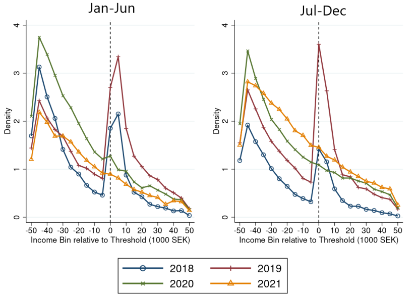

Hi! I am a 1st year MRes/PhD student in Economics at the London School of Economics.

### Research

  

    For my [MSc dissertation](papers/MSc_Dissertation_RasmusDuret.pdf), I used administrative data from Sweden to investigate how a COVID-related change to students' stipend conditions affected their choice to work part-time. Using bunching, instrumental variables, and diff-in-diff methods, I estimated large behavioural responses: a 10-12% increase in average income.
  

  

    
  

For my [BSc dissertation](papers/BSc_Dissertation_RasmusDuret.pdf), I developed a simple network-based model of social capital to provide a theoretical background to the empirical findings of Chetty et al. (2022), and replicated their key findings of emergent segregation using county-level US data.

### Education
* MRes/PhD Economics, LSE
* MSc Economics, LSE (2024)
* BSc Economics, UCL (2023)

### Experience
* 2024-25: Predoctoral Fellow, Public Economics group at LSE.
    Investigated [health inequality](https://personal.lse.ac.uk/spinnewi/CDI_draft.pdf) in the Netherlands using administrative data.
* 08/2024: Summer Student, Institute for Fiscal Studies.
    Analysed the [socioeconomic effects of social housing](https://drive.google.com/file/d/1R5-VTjLFVZc8GVkRk5fwY_dcMR1uhuPu/view) in the UK.
* 2022-25: Researcher, CORE Economics.
    Contributed a [case study on Denmark's flexicurity system](https://books.core-econ.org/the-economy/macroeconomics/02-unemployment-wages-inequality-10-application-labour-market-denmark.html) to the CORE Economy 2.0 textbook.
* 2022-23: Research Assistant, UCL.

[My CV is available here.](papers/Resume_RasmusDuret.pdf)

### Contact
- Email: r.duret@lse.ac.uk

